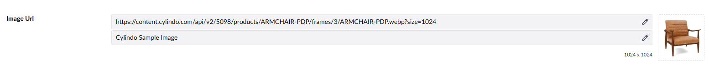

# CDN Image

`Catalyst.CdnImage` stores an absolute CDN image URL and descriptive alt text. It provides a compact backoffice editor with image preview and natural pixel dimensions.



## Configuration

Create a data type using the `Catalyst.CdnImage` editor. Configure:

- `allowedPrefixes`: comma-separated URL prefixes. Empty allows any URL.
- `requireAltText`: marks alt text as required, default `true`.
- `previewHeight`: preview area height in pixels, default `200`.

## Stored value

A value retrieved through a converter is `CdnImageValue`:

```json
{
  "url": "https://cdn.example.com/images/hero.jpg",
  "altText": "Product displayed on a white background"
}
```

`HasValue` is `true` when `Url` is not blank. Empty values return `CdnImageValue.Empty`.

## Razor usage

```csharp
@using Umbraco.Catalyst.Core.Extensions
@using Umbraco.Catalyst.DataTypes.CdnImage

@{
    var image = Model.CatalystValue<CdnImageValue>("heroImage");
}

@if (image?.HasValue == true)
{
    
}
```

`CdnImageValue.ToImgTag()` can generate an encoded image tag:

```csharp
@Html.Raw(image?.ToImgTag("hero-image") ?? string.Empty)
```

## Create or update through API

The authenticated Catalyst API accepts a CDN Image value through:

```http
POST /umbraco/catalyst/api/v1/content/{contentId}/property/heroImage
Content-Type: application/json
```

```json
{
  "editorAlias": "Catalyst.CdnImage",
  "value": {
    "url": "https://cdn.example.com/images/hero.jpg",
    "altText": "Product displayed on a white background"
  },
  "saveMode": "Draft"
}
```

See [API documentation](api.md) for the complete endpoint list and response format.
