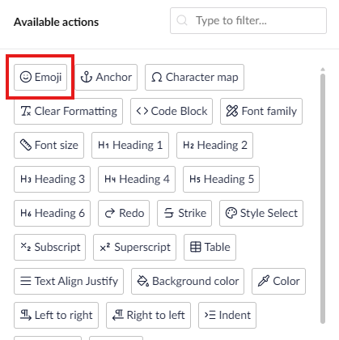
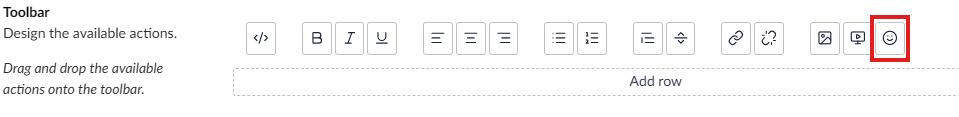
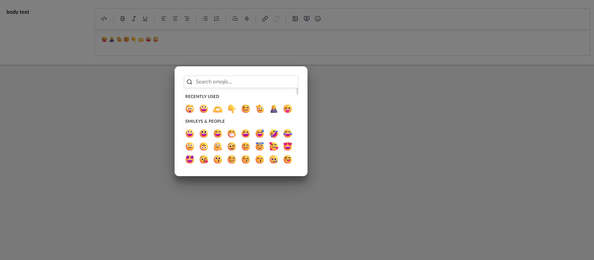

# TipTap Emoji

`Catalyst.Tiptap.Emoji` adds a searchable emoji picker to Umbraco's TipTap Rich Text Editor toolbar.

## Installation and configuration

1. Install the `Phases.Umbraco.Community.Catalyst` NuGet package.
2. Open **Settings > Data Types**.
3. Open a Rich Text Editor data type.
4. Add the Catalyst Emoji action to the TipTap toolbar.
5. Save the data type.

The extension loads from the package static web assets. No manual JavaScript registration or `App_Plugins` file copy is required.

## Usage

Open content containing the configured Rich Text Editor. Select the Emoji action, search by name or keyword, then select an emoji to insert it at the current cursor position.

The extension does not introduce a separate property value model or REST endpoint. Emoji content remains part of the Rich Text Editor value.
